<div align="center">

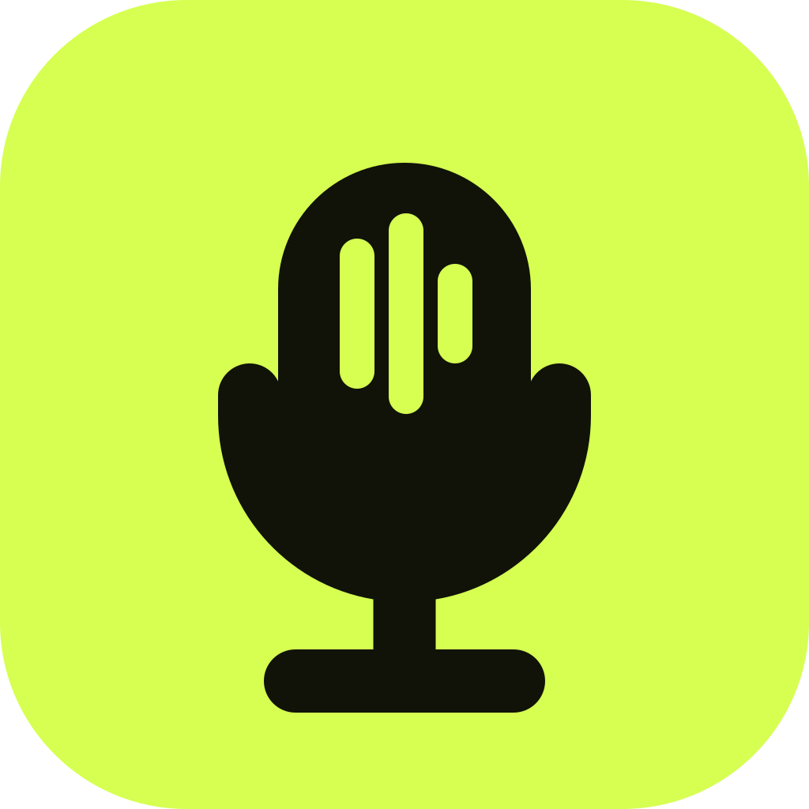

# Sout

**Egyptian Arabic dictation for Windows.**
Press a key, speak, press again — the text lands in whatever you were typing.


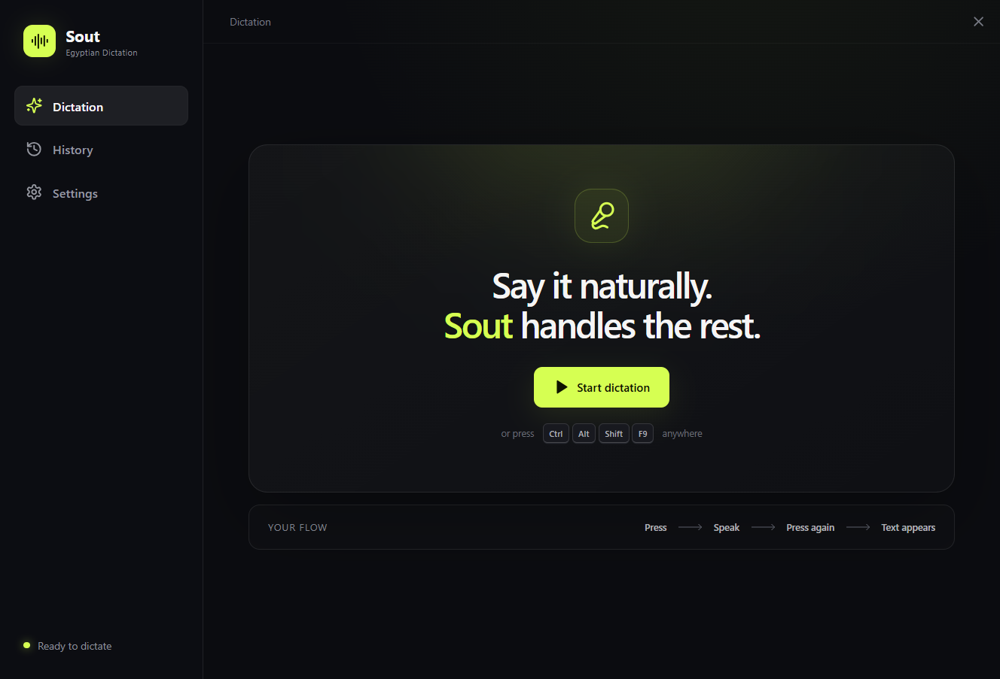

</div>

---

## How it works

Sout stays in the system tray and listens for one global shortcut (`Ctrl+Shift+Space` by default). It works from **any** application.

| 1. Press the hotkey | 2. Speak | 3. Press again | 4. Text appears |
|:--:|:--:|:--:|:--:|
| A small pill appears at the bottom of your screen and the microphone opens immediately | The waveform follows your voice — Egyptian Arabic, English, or both mixed | The pill switches to a "thinking" wave while Gemini transcribes | The formatted text is pasted into the app you were using and the pill disappears |

The whole cycle is designed to stay out of the way: no windows to manage, no buttons to click, no text to read — unless something goes wrong.

## The floating recorder

A single transparent pill. Opening the mic, recording, transcribing, done, and error are all the same shape; only the orb and the wave change.

<table>
<tr><th></th><th>Dark</th><th>Light</th></tr>
<tr>
<td><b>Recording</b><br/><sub>Live waveform, timer. Click the orb or press the hotkey again to stop, <kbd>Esc</kbd> or × to cancel.</sub></td>
<td>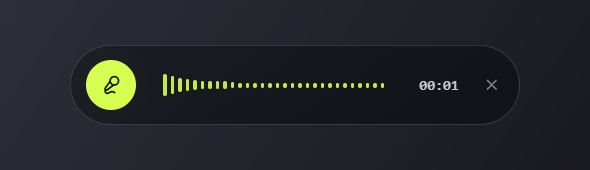</td>
<td>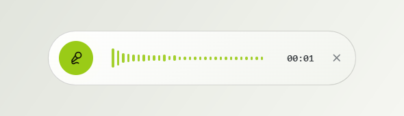</td>
</tr>
<tr>
<td><b>Transcribing</b><br/><sub>A sweeping wave while Gemini works (~3 seconds).</sub></td>
<td>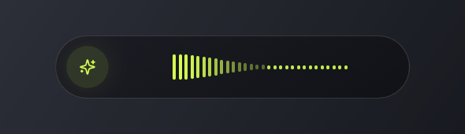</td>
<td>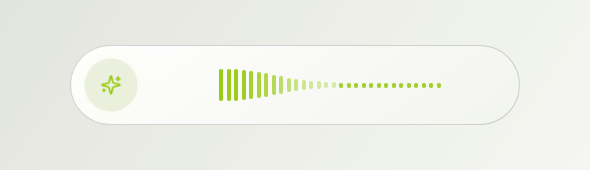</td>
</tr>
<tr>
<td><b>Done</b><br/><sub>Shown briefly when auto-paste is off, then closes.</sub></td>
<td>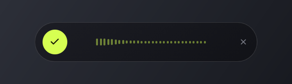</td>
<td>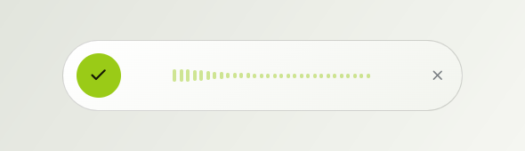</td>
</tr>
<tr>
<td><b>Error</b><br/><sub>One short line, closes by itself after a few seconds.</sub></td>
<td>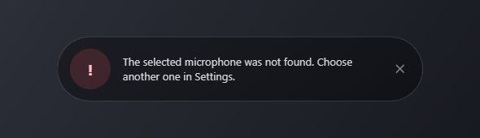</td>
<td>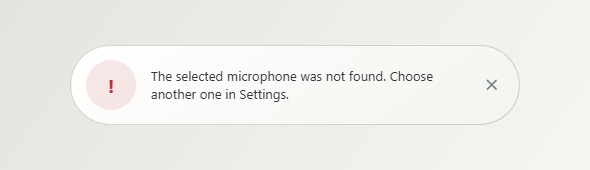</td>
</tr>
</table>

The pill always appears on the monitor your cursor is on: **bottom center** (default), **top center**, or **center** of the screen.

## Features

- **Global hotkey** — start and stop from any app; fully configurable
- **Egyptian Arabic + English** — code-switching is kept as spoken, with English words, names, and technical terms intact
- **Natural formatting** — punctuation, paragraphs, and capitalization added; obvious repetitions and filler removed; your tone preserved
- **Paste where you were** — returns focus to the previous window and inserts the text automatically
- **Floating pill recorder** — transparent, always on top, no text to read
- **Microphone picker + level test** — choose an input and check it before dictating
- **Local history** — optional, text only, stored on your PC; copy or delete entries any time
- **Dark and light themes**
- **Tray app** — start dictation, open history or settings, pause the hotkey, launch at Windows startup
- **Private by design** — see [Privacy](#privacy)

## Screens

### Dictation

The home screen. Start from here or just press the hotkey from anywhere.

<table>
<tr><th>Dark</th><th>Light</th></tr>
<tr>
<td></td>
<td>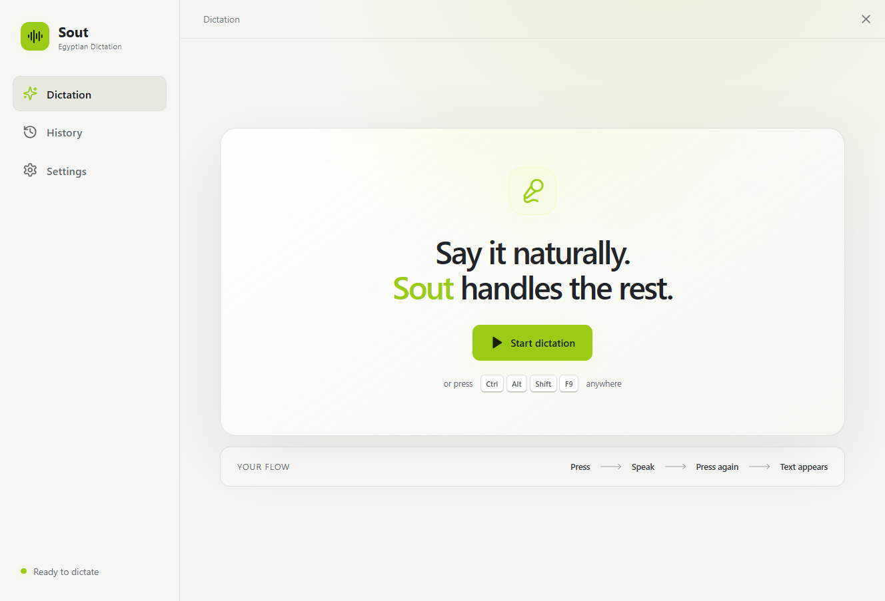</td>
</tr>
</table>

### History

Every completed dictation with its time. Arabic entries render right-to-left, English left-to-right. Copy, delete one, or clear all.

<table>
<tr><th>Dark</th><th>Light</th></tr>
<tr>
<td>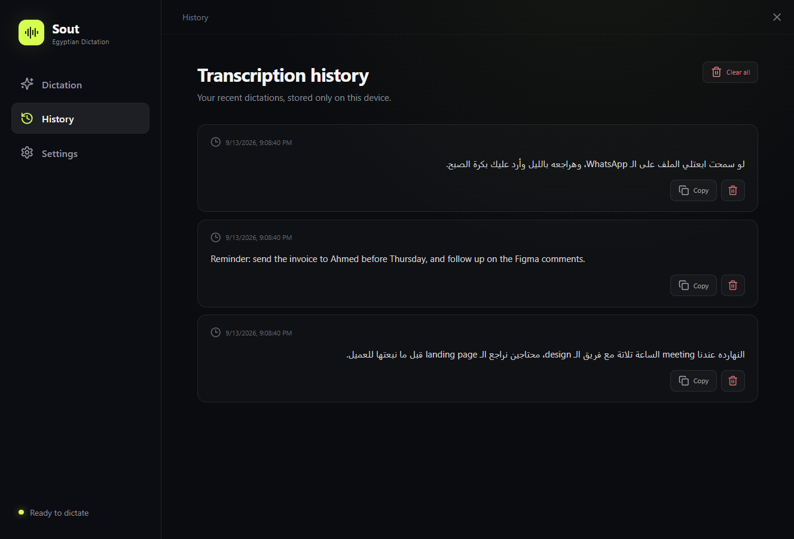</td>
<td>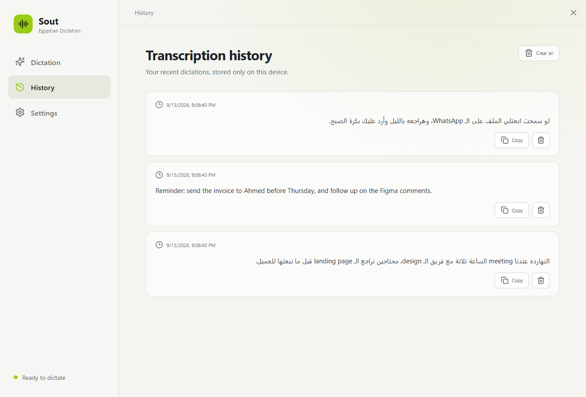</td>
</tr>
</table>

### Settings

Gemini key, hotkey, microphone, recorder placement, output behaviour, and appearance.

<table>
<tr><th>Dark</th><th>Light</th></tr>
<tr>
<td>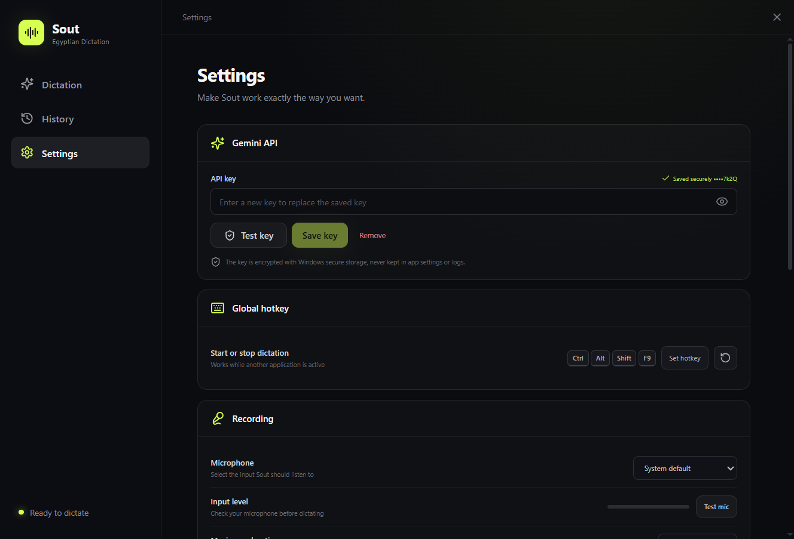</td>
<td>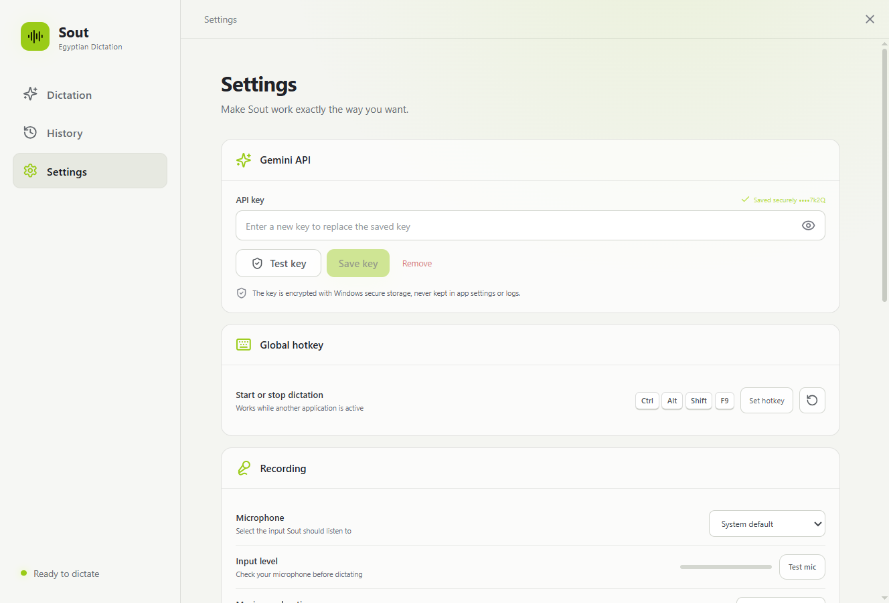</td>
</tr>
<tr>
<td>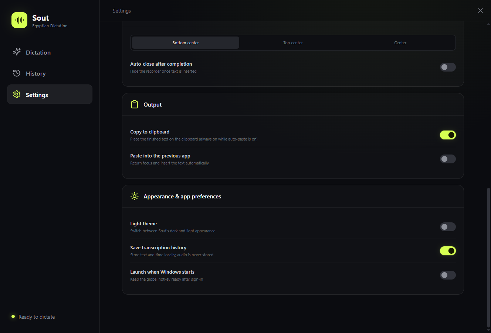</td>
<td>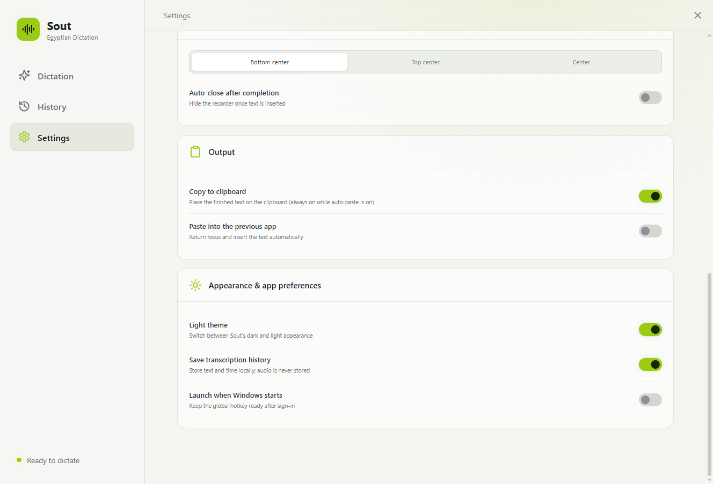</td>
</tr>
</table>

| Section | Options |
|---|---|
| **Gemini API** | Paste a key, test it, save it (encrypted), remove it |
| **Global hotkey** | Record any combination with Ctrl / Alt / Shift / Win; reset to default |
| **Recording** | Microphone, input-level test, maximum duration (1 – 10 min) |
| **Floating recorder** | Bottom center · Top center · Center; auto-close after completion |
| **Output** | Copy to clipboard; paste into the previous app |
| **Appearance & app** | Light theme; save history; launch when Windows starts |

## Get started

### 1. Install

Grab one of the builds from `release\` (or build them yourself, see [Development](#development)):

| File | What it is |
|---|---|
| `Sout-Setup-1.0.0.exe` | Regular installer — Start Menu entry, desktop shortcut, uninstaller |
| `Sout-Portable-1.0.0.exe` | Single file, nothing installed — just run it |

The app isn't code-signed, so Windows SmartScreen will show *"Windows protected your PC"* the first time. Click **More info → Run anyway**.

### 2. Add a Gemini API key

Sout needs your own (free) Gemini API key. On first launch it opens Settings and asks for one.
The full walkthrough — creating the key in Google AI Studio, pasting it in, what the messages mean — is in **[GEMINI-API-KEY.md](GEMINI-API-KEY.md)**.

### 3. Dictate

Put the cursor where you want text, press `Ctrl+Shift+Space`, speak, press it again. Done.

Windows may ask for microphone permission the first time — allow it (or enable it later under *Settings → Privacy → Microphone*).

## Privacy

- **API key** — encrypted with Windows DPAPI through Electron's `safeStorage`; only your Windows account on this PC can decrypt it. Never written to settings, logs, or the UI layer.
- **Audio** — recorded in memory, sent once to the Gemini API, then discarded. Nothing is written to disk. Requests are made with `store: false`, so Google does not keep the interaction.
- **History** — text and timestamps only, in `%APPDATA%\sout-egyptian-dictation\history.json`. Turning history off also clears it.
- **Network** — the only endpoint the app talks to is `generativelanguage.googleapis.com`. No analytics, no telemetry, no update checks.

## Development

Requirements: Windows 10/11, Node.js 20+. No Rust, Visual Studio, or Windows SDK needed.

```powershell
npm install
npm run desktop:dev          # Vite dev server + Electron
```

```powershell
npm run build:win                    # renderer build + NSIS installer  -> release\Sout-Setup-1.0.0.exe
npx electron-builder --win portable  # single-file portable exe          -> release\Sout-Portable-1.0.0.exe
npx electron-builder --win dir       # unpacked folder only              -> release\win-unpacked\Sout.exe
```

### How it's put together

```
electron/
  main.cjs        main process: windows, tray, global hotkey, Gemini requests, encrypted key, settings & history
  preload.cjs     the small IPC bridge exposed to the renderer (window.sout)
src/
  App.tsx         all UI — Settings/History window and the recorder pill (same bundle, two windows)
  styles.css      theme tokens, app shell, pill animations
  lib/bridge.ts   typed wrappers around window.sout
  types.ts        settings model and defaults
docs/screenshots  images used in this README
```

The recorder pill runs in its **own transparent, always-on-top window** that loads the same bundle with `#overlay`; the main window handles Settings and History. Transcription goes through the Gemini Interactions API using `gemini-3.6-flash` with a low thinking level (fast, no reasoning tokens) and an Egyptian-Arabic system instruction that preserves code-switching and tone. The model, endpoint, and instruction live at the top of `electron/main.cjs`.

## Tech

Electron 44 · React 18 · TypeScript · Vite 6 · lucide-react · electron-builder · Gemini 3.6 Flash
